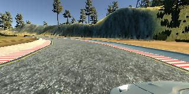
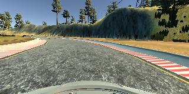
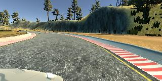
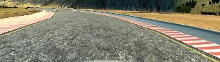

# **Behavioral Cloning** 

This project mainly focuses on mimicing humans' driving behaviors via neural network and simulating it into the Game.

---

**Behavioral Cloning Project**

The goals / steps of this project are the following:

* Use the simulator to collect data of humans' driving behaviors. It was generated by three different cameras  (left, mid, right) embedded in the font of the car.
* Construct a neural network in keras in order to solve the regression problem, which is by training the network to predict how much of the angle the car should shift.
* Train and validate the model with a training and validation set.
* Test that the model successfully drives around track one without leaving the road.


[//]: # (Image References)

[image1]: ./Images/cropped_img.jpg
[image2]: ./Images/angle_data.png
[image3]: ./Images/angle_data_boom.png
[image5]: ./Images/boom.png
[image6]: ./Autonomous_Mode.gif

## Rubric Points
### Here I will consider the [rubric points](https://review.udacity.com/#!/rubrics/432/view) individually and describe how I addressed each point in my implementation.  

---
### Files Submitted & Code Quality

#### 1. Submission includes all required files and can be used to run the simulator in autonomous mode

My project includes the following files:

* model.py containing the script to create and train the model.
* drive.py for driving the car in autonomous mode.
* model.hdf5 containing a trained convolution neural network.
* writeup_report.md or writeup_report.pdf summarizing the results.

#### 2. Submission includes functional code
Using the Udacity provided simulator and my drive.py file, the car can be driven autonomously around the track by executing
```sh
python drive.py model.hdf5
```

#### 3. Submission code is usable and readable

The model.py file contains the code for training and saving the best weights of my convolution neural network. The file contains comments to show how each function works. And I have all functions compacted in the model.py.

### Model Architecture and Training Strategy

#### 1. An appropriate model architecture has been employed

I was inspired by the paper [End to End Learning for Self-Driving Cars](https://arxiv.org/abs/1604.07316) from NVIDIA. And also I have modified the activation functions into 'ReLU' instead of 'ELU'.

My model has total nine layers. The first five layers are all convolutional layers and the rest of the four are fully-connected layers. Among the convolutional layers, the first three are convolved by 5x5 filters, and the other two are convolved by 3x3 filters. The number of filters are 24, 36, 48, 64, 64 respectively (model.py lines 99-103).

The other four fully-connected layers have their sizes 100, 50, 10, 1 respectively (model.py lines 105-108).

And the difference between my network and network in the paper is the activation functions. I changed activations function of all convolutional layers (model.py lines 99-103).

#### 2. Attempts to reduce overfitting in the model

My model only picks the best weights after training and validation.

My weights was put into the simulator to ensure there is no overfitting in the model.

#### 3. Model parameter tuning

My model uses 'Adam' optimizer and it has such properties:
```sh
m_0 <- 0 (Initialize initial 1st moment vector)
v_0 <- 0 (Initialize initial 2nd moment vector)
t <- 0 (Initialize timestep)
```
The update rule for variable with gradient g:
```sh
t <- t + 1
lr_t <- learning_rate * sqrt(1 - beta2^t) / (1 - beta1^t)

m_t <- beta1 * m_{t-1} + (1 - beta1) * g
v_t <- beta2 * v_{t-1} + (1 - beta2) * g * g
variable <- variable - lr_t * m_t / (sqrt(v_t) + epsilon)
```
Also, it has defult epsilon which is 1e-08 and its value of weight_decay is 0.0.

#### 4. Appropriate training data

Because there are total three cameras embedded in the front of the car, I used all of them to generate proper data for training. For example, the simulator creates a file named 'driving_log.csv' which contains all three images' names (center, left, right) captured by three different cameras and those images are contained in the folder named '/IMG'. Besides, the 'driving_log.csv' contains the steering_angle, speed, throttle, brake_flag data. In this project I only used steering_angle as training label since the speed is controlled by the throttle and brake and its value affects nothing much but the GPU processing speed.

### Model Architecture and Training Strategy

#### 1. Visualizing the data & modifying it

Before training the network, we have to visualize the data, for example, images from three different angles.

<p align="middle">
    
    
    
</p>

We can see that the left image has shifted to left a little bit compared with the center image, so we have to add a correction into steering_angle before using the left image in training. So as to the right image, we have to minus a correction into steering_angle. And in our model, we set up the correction as 0.2.

Meanwhile, for each of the training image, we have to get rid of redundant information in it. For example, the image has size 320x160 and the upper part of the image consists of redundant features, like trees, sky, hills. These features may disturb our network. So we crop out 50 pixels from the upper part and 20 pixels from the lower part and hence we have our final image resized into 320x90.

<p align="middle">
    
</p>


#### 2. Model Architecture


After having visualized the images, we then see how the steering_angle looks like.

![steering_angle][image2]

The steering_angle data has distributed around zero, which means that we have collect a good driving behavior data. However, due to the shape of track, which has more left corners than right corners, negative steering_angles appear more than positive ones. So we decide to flip the images and steering_angles in order to balance both side around zero point.

![steering_angle after modified][image3]

#### 3. Training Process & Results


After that, we shuffle the image data into two parts, training data and validation data, with the ratio 8:2.

#### 2. Model Architecture


The model is a hierachical network. The network takes input image as shape 320x90x3 and normalizes it in each channel. It means that for each channel (R, G, B), all entries in 320x90 matrix should be divided by 127.5 and then subtracted by 1. It makes value of all entries in matrix range from -1 to 1.

Next, normalized images convolve 24, 36, 48 filters with kernel_size 5. And the stride for the first three convolutional layers is 2, while using 'valid' padding and 'ReLU' activation function. Then, feature maps convolve 64, 64 filters with kernel_size 3, while the stride is 1, 'valid' padding and 'ReLU' activation function.

After that, we flatten the output of the last convolutional layer, which is a 8448x1 vector and put the vector consecutively into 100, 50, 10 fully-connected layers. Last, our network takes the 10x1 vector and output a number.

![Network Architecture][image5]


#### 3. Training Process & Results

At first, we try to collect good driving behaviors by shiftting the car smoothly. Then we feed our network with cropped RGB images and let the network using the 'MSE' to back propagate the weights. We use the Adam optimizer to optimize our network and in order to keep the best weights, we set up one check pointer monitoring the validation loss. The one who has minimum validation loss is our best weights.

After training, we save the best weights into "model.hdf5" and run it in autonomous mode in game.

![Autonomous Mode][image6]


